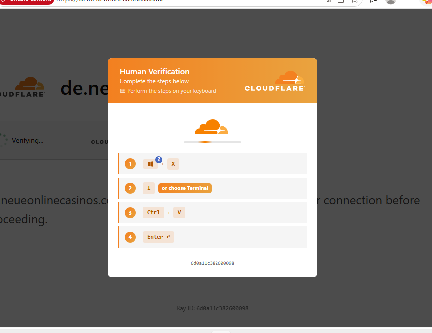
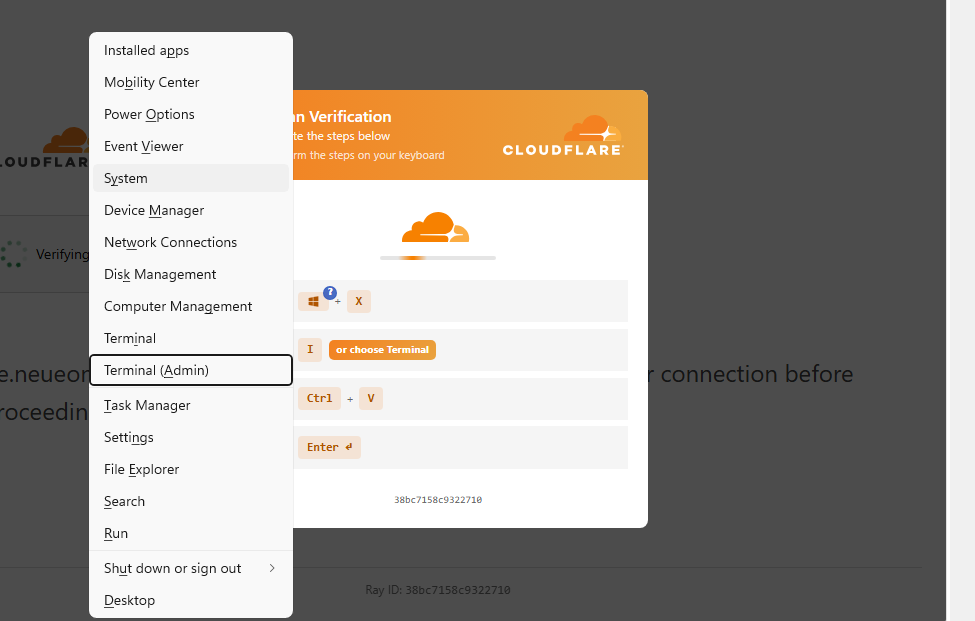
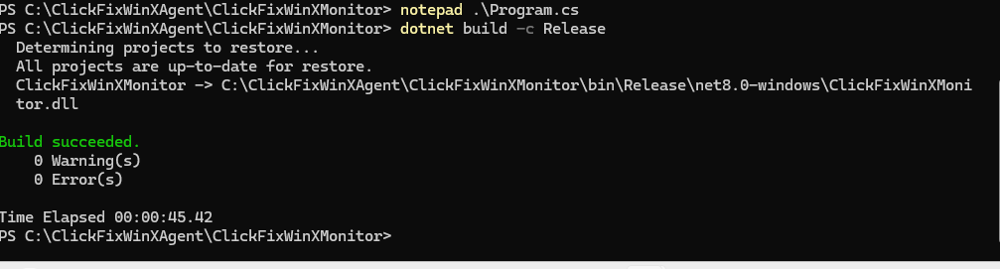
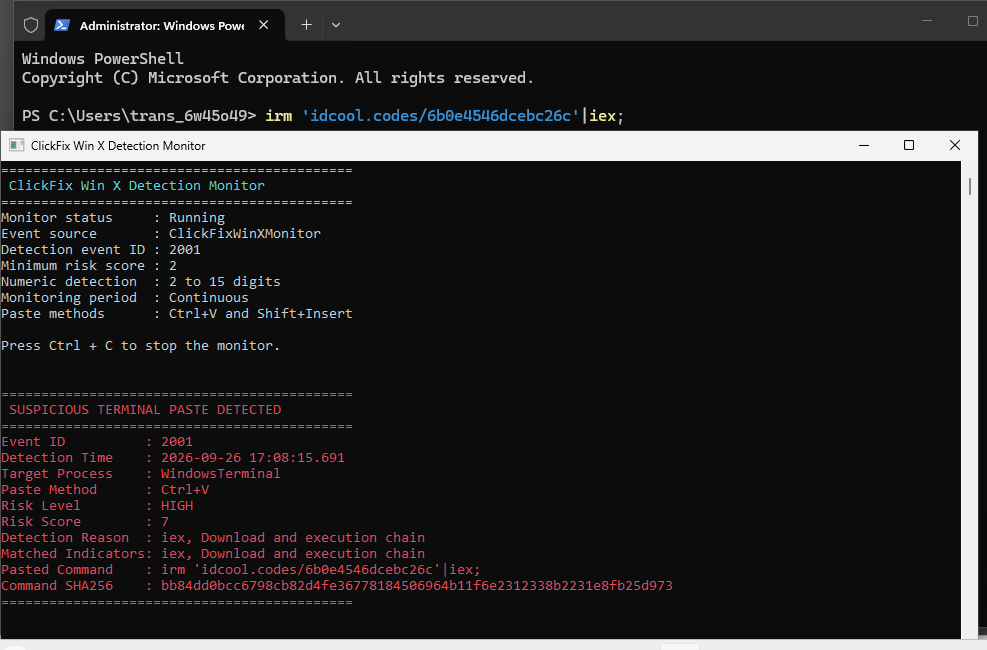
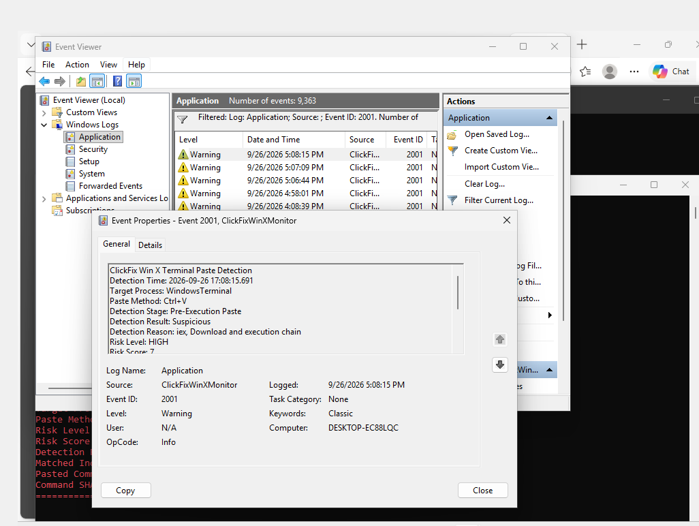
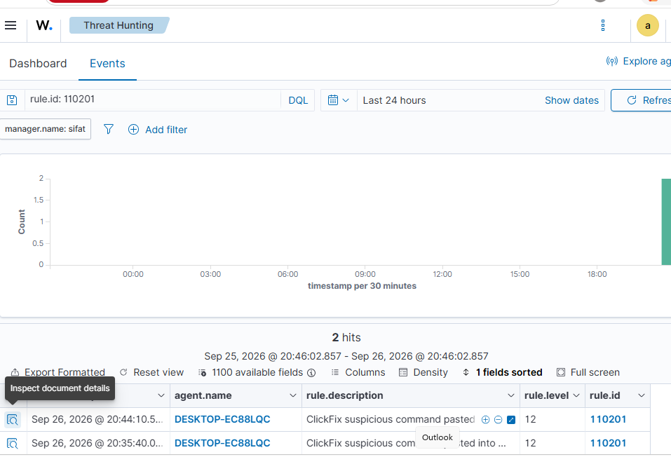
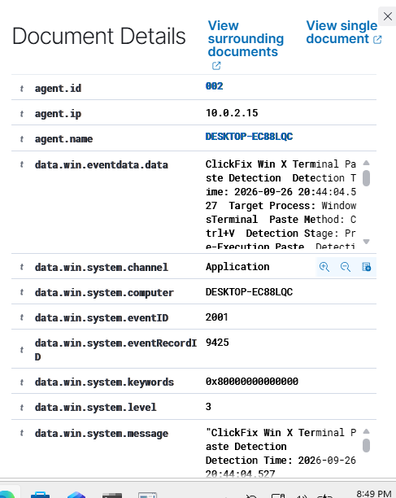
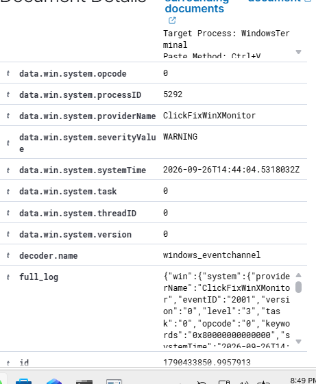
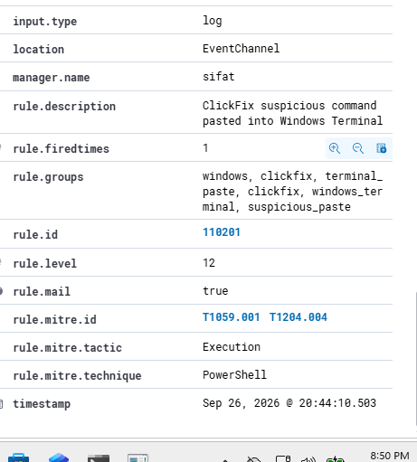

# ClickFix Win+X Terminal-Paste Detection with Wazuh SIEM

A step-by-step Windows and Wazuh lab showing how a ClickFix-style **Win+X → Terminal → Ctrl+V** instruction can be observed and alerted on. The endpoint tool records a suspicious paste as **Windows Application Event ID 2001**; a custom Wazuh rule raises **alert 110201**.

**What the demonstration proves:** suspicious text was pasted into a monitored terminal, Event ID 2001 was written, and Wazuh received an alert. The tool does not independently record the Win+X keypress or prove that the pasted command executed.

## At a glance

| Role | Lab system |
| --- | --- |
| Windows test endpoint | Windows 11 Pro, `DESKTOP-EC88LQC`, Wazuh agent `002` |
| Wazuh manager | `sifat` |
| Endpoint project | [C# source and .NET project](src/ClickFixWinXMonitor/) |
| Wazuh configuration | [Agent collection block](config/wazuh-agent-ossec-fragment.xml) and [manager rule](config/clickfix_win_x_rules.xml) |
| Screenshots | [`evidence/`](evidence/) |

**Prerequisites:** .NET 8 SDK, an elevated PowerShell window on Windows, a connected Wazuh Windows agent, and access to the Wazuh manager. Use an isolated test machine and synthetic clipboard values.

## Step 1 — See the simulated ClickFix instruction

The test page displayed a verification-style instruction. The lab user opened the terminal with **Win+X → I**, then pasted with **Ctrl+V**. You do not need to visit the pictured page to repeat the detection test; Step 4 provides harmless values.





[View the original page screenshot](evidence/clickfix-lure-page.png)

## Step 2 — Create the Windows endpoint project

Open **PowerShell as Administrator** on the Windows endpoint. Confirm the SDK is installed with `dotnet --version`; install .NET 8 if it is missing. Create the project:

```powershell
cd C:\
mkdir ClickFixWinXAgent
cd ClickFixWinXAgent
dotnet new console -n ClickFixWinXMonitor
cd ClickFixWinXMonitor
dotnet add package System.Diagnostics.EventLog --version 8.0.1
```

Copy [`Program.cs`](src/ClickFixWinXMonitor/Program.cs) and [`ClickFixWinXMonitor.csproj`](src/ClickFixWinXMonitor/ClickFixWinXMonitor.csproj) from this repository into `C:\ClickFixWinXAgent\ClickFixWinXMonitor`, replacing the two generated files. The project targets `net8.0-windows` and enables Windows Forms for clipboard access.

Build and check the output:

```powershell
dotnet restore
dotnet build
```

**Expected:** `Build succeeded`, with no errors. This is the build output captured during the lab:



## Step 3 — Register the Event Log source and run the tool

In elevated PowerShell, register the source once:

```powershell
if (-not [System.Diagnostics.EventLog]::SourceExists("ClickFixWinXMonitor")) {
    New-EventLog -LogName Application -Source ClickFixWinXMonitor
}
```

Publish the Windows executable:

```powershell
dotnet publish -c Release -r win-x64 --self-contained true -p:PublishSingleFile=true
```

Start it from an elevated PowerShell window:

```powershell
Start-Process "C:\ClickFixWinXAgent\ClickFixWinXMonitor\bin\Release\net8.0-windows\win-x64\publish\ClickFixWinXMonitor.exe" -Verb RunAs
```

**Expected:** the monitor window says `Running`, `Event ID 2001`, minimum score `2`, and `Ctrl+V and Shift+Insert`. Keep this window open during the tests.

## Step 4 — Test the paste detection

Copy each value, open a terminal with **Win+X → I**, and paste with **Ctrl+V**. **Do not press Enter.** The monitor only emits Event ID 2001 when the clipboard content has a suspicious score of at least 2.

| Clipboard value | Expected monitor result |
| --- | --- |
| `105567241` | Numeric value of 2–15 digits; `MEDIUM`, score `2`, Event ID `2001` |
| `hello` | No suspicious indicator; no Event ID `2001` for this paste |
| `powershell -nop -w hidden https://example.invalid/test` | Multiple command indicators; warning Event ID `2001` |

The original lab used a command-like sample with `iex` and a download/execution pattern. Its monitor output showed **WindowsTerminal**, **Ctrl+V**, **HIGH**, and score **7**. The pictured command is evidence; do not execute it.



[Close-up of the endpoint monitor result](evidence/endpoint-monitor-detection.png)

**How the tool works:** [`Program.cs`](src/ClickFixWinXMonitor/Program.cs) checks Ctrl+V or Shift+Insert while a supported terminal is in front, scores clipboard indicators, and writes suspicious results to the Application log. It does not alert on every clipboard change.

## Step 5 — Verify Event ID 2001 on Windows

Open **Event Viewer → Windows Logs → Application → Filter Current Log**, enter `2001`, and open an event whose source is `ClickFixWinXMonitor`. The event should show the target process, paste method, detection reason, risk score, and time.

Alternatively, use PowerShell:

```powershell
Get-WinEvent -FilterHashtable @{
    LogName      = 'Application'
    ProviderName = 'ClickFixWinXMonitor'
    Id           = 2001
} -MaxEvents 5 | Format-List TimeCreated, ProviderName, Id, LevelDisplayName, Message
```

This screenshot shows the lab's **Application / ClickFixWinXMonitor / Event ID 2001** warning:



## Step 6 — Send the Windows event to Wazuh

On the **Windows endpoint**, open `C:\Program Files (x86)\ossec-agent\ossec.conf`. Inside its existing `<ossec_config>` section, add the [Application collection block](config/wazuh-agent-ossec-fragment.xml):

```xml
<localfile>
  <location>Application</location>
  <log_format>eventchannel</log_format>
</localfile>
```

Keep all other agent configuration. Restart and verify the agent:

```powershell
Restart-Service -Name wazuh
Get-Service -Name wazuh
```

**Expected:** the agent is running and Wazuh can receive Windows Application events from agent `002`.

## Step 7 — Install custom rule 110201 on the Wazuh manager

On the **Linux Wazuh manager**, put [`config/clickfix_win_x_rules.xml`](config/clickfix_win_x_rules.xml) at:

```text
/var/ossec/etc/rules/clickfix_win_x_rules.xml
```

The lab rule matches provider `ClickFixWinXMonitor` plus Event ID `2001` and raises **rule 110201, level 12**. Test the rule and restart the manager:

```bash
sudo /var/ossec/bin/wazuh-analysisd -t
sudo systemctl restart wazuh-manager
sudo systemctl is-active wazuh-manager
```

**Expected:** syntax check succeeds and the manager reports `active`. The rule file includes ATT&CK IDs `T1059.001` and `T1204.004` as the lab's mapping. A paste event alone does not confirm execution.

## Step 8 — Confirm the alert in the Wazuh dashboard

Repeat the suspicious paste test after the agent and manager are running. In Wazuh's alert Events view, filter for **rule.id `110201`** or **eventID `2001`**. Open the result and check:

| Field | Expected lab value |
| --- | --- |
| `agent.id` | `002` |
| `agent.name` | `DESKTOP-EC88LQC` |
| `data.win.system.channel` | `Application` |
| `data.win.system.eventID` | `2001` |
| `data.win.system.providerName` | `ClickFixWinXMonitor` |
| `rule.id` / `rule.level` | `110201` / `12` |









## Result and limits

**Observed lab chain:** Win+X terminal workflow → suspicious paste detected → Windows Application Event ID 2001 → Wazuh agent 002 → custom rule 110201 → level 12 dashboard alert.

The event records a pasted command preview and hash. Use harmless data in the lab and restrict access to logs because clipboard contents may be sensitive. Confirm actual command execution separately with process, PowerShell, and network telemetry. The source and configuration here follow the supplied lab document; this repository has not been rebuilt on a Windows host during this update.
